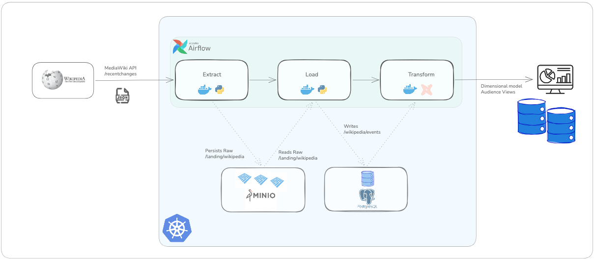

# Data Platform Monorepo

This repository contains an end to end data platform that ingests Wikipedia page change events, lands data in object storage, loads it into PostgreSQL, and orchestrates transformations with dbt through Airflow. It is designed as a containerized, Kubernetes-based setup for development and demo workflows, with infrastructure, jobs, and orchestration code managed in one place.


## Quickstart

> In order to run the project locally, `Docker` and `Kind` needs to be installed

Before running the platform, create a local environment file for demo credentials:

```bash
cp .env.example .env
```

Update values in `.env` as needed. The Makefile automatically loads `.env` if present.

Once Docker and Kind are installed, you can run below command to spin up the resources and run the project locally
```bash
make create
```
This make target performs the following:

- Create a Kubernetes cluster using Kind
- Deploy Minio and configure access policies for extract and load pipeline services
- Deploy Postgres and create databases, as well as logins for extract and load services, as well as dbt and airflow
- Build docker images for extract, load and dbt services and upload these images to Kind cluster nodes
- Deploy Airflow for orchestration

⚠️ Depending on the system's resources, deployment might take a few minutes to be ready. To avoid transient errors and prevent failing runs, the Airflow DAG is paused by default. It is advised to monitor the kubernetes deployment before toggling it on and running the pipeline.

Once you are done, you can invoke following command to stop the cluster and destroy the resources. 
```bash
make teardown
```
 
## Solution 

The solution consists of shared components (minio and postgres), containarized services for extract and load stages of data pipeline, as well as a dbt project for transforming raw data into analytics ready tables. Execution and scheduling of the pipeline stages are orchestrated by Airflow, and  All of these components are deployed to a kubernetes cluster, as illustrated below.




## Technical Decisions
### Wikipedia Page Edits API vs Github Events
  
([Wikipedia's Recent Changes](https://www.mediawiki.org/wiki/API:RecentChanges)) endpoint has been used intead of GitHub events, for following reasons.
- Throttling: Wikipedia's endpoint supports up to 200 requests per second, anonymously, whereas Github's rate limit policy is 60 requests per minute. Considering backfilling and pagination, this becomes a limitation.
- Data Volume: Wikipedia's page change events are in the order of 1000s per hour, whereas Github's changes are more frequent and the endpoint is only able to provide last 300 events. This causes the extract step to become time critical, as the delays between successive runs would introduce a time gap in the raw events table. 
- Time-based pagination: Wikipedia's endpoint offers pagination based on time intervals, which fits better for the ingestion pipeline and makes backfilling possible, in contrast to Github's endpoint.

### Apache Parquet vs Json
  
For landing dataset, Apache Parquet has been used as an alternative to raw json based on following criteria:
- Compression: Using built-in snappy compression, Parquet is more storage efficient and reduces API costs and network traffic on S3
- Partition Friendliness: Although partitioning is not part of parquet spec itself, main query engines work seamlessly with partitioned layouts.
- Typed Schema: Parquet stores data with a defined schema, which enforces types on columns and eliminates the need to parse each field downstream
- Columnar storage: Although this is not an immediate requirement, using Parquet would enable broad range of tools to work on this dataset efficiently

### Poetry for Python Projects

Poetry has been used for dependency management and packaging. A popular alternative would be `uv`. The choice of poetry was motivated based on familiarity of the tool, rather than a technical advantage or limitation.

### Airflow Orchestration
Although not listed as a core requirement, having basic orchestration would be useful for development and testing cycle, as well as review time reproducability, therefore Airflow was deployed using official helm chart along with a simple DAG to run the deliverables and backfill some data. 

## Remarks
This submission prioritizes a reproducible end-to-end local pipeline and deployable infrastructure. 

Current gaps and planned follow-ups:
- Unit tests need to be extended for extract/load service modules.
- dbt modeling is currently limited to staging; dimensional modeling (including SCD2 patterns) is planned next.

